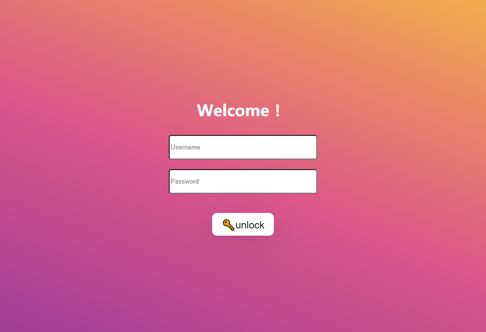

<br>

<p>
  Screen Lock based on Electron-react-boilerplate, uses <a href="https://electron.atom.io/">Electron</a>, <a href="https://facebook.github.io/react/">React</a>, <a href="https://github.com/reactjs/react-router">React Router</a>, <a href="https://webpack.github.io/docs/">Webpack</a> and <a href="https://www.npmjs.com/package/react-refresh">React Fast Refresh</a>.
</p>

<br>

## Abstract
- Screen Lock
- keyboard shortcuts Lock 
  - Alt + Tab
  - Alt + F4
  - Ctrl + Alt + delete
  - ....
- application auto power on
## Install
First, clone the repo via git and install dependencies:

```bash
git clone https://github.com/Mad-hu/ScreenLock.git
cd ScreenLock
yarn
```

## Starting Development

Start the app in the `dev` environment:

```bash
yarn start
```

## Packaging for Production

To package apps for the local platform:

```bash
yarn package
```

## Maintainers

- [Mad-hu](https://github.com/Mad-hu)

## License

MIT © 
